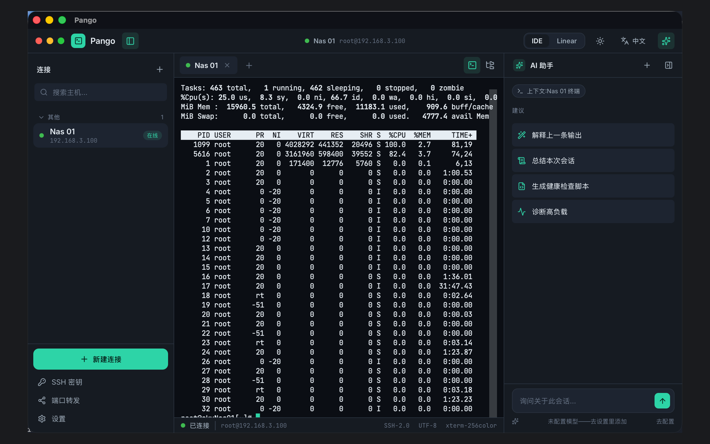

# Pango

**A fast, unlimited SSH & SFTP client for people who run servers.** / **为天天和服务器打交道的人打造的、不限连接数的 SSH & SFTP 客户端。**

Built for the desktop with Tauri, Rust, and React. No artificial limits — unlimited saved connections and concurrent sessions.

## Highlights

- **Real terminal** — xterm.js over a Rust `russh` PTY; password or private-key auth.
- **Host-key verification** — trust-on-first-use with an interactive prompt on an unknown or changed key.
- **SFTP done properly** — dual-pane browser, drag-and-drop, recursive transfers, resume, pause/cancel, remote edit.
- **Port forwarding** — local (`-L`), dynamic SOCKS5 (`-D`), and remote (`-R`).
- **ProxyJump / bastions** — tunnel through one or more jump hosts.
- **Server dashboard** — live CPU / memory / load / disk / network with sparkline history.
- **Split & broadcast** — up to four sessions side by side.
- **AI assist** — streaming chat (Anthropic / OpenAI-compatible / Ollama) with session context.
- **Secrets in the OS keychain** — nothing sensitive written to plain disk.

## Editions

| | Pango Pro | Pango (App Store) |
|---|---|---|
| Distribution | Direct download (Developer ID, notarized DMG) | Mac App Store (sandboxed) |
| Port forwarding, local key management, local file browser | ✅ | restricted by sandbox |

## Links

- **Support / 反馈**: [open an issue](../../issues)
- **Privacy Policy / 隐私政策**: [privacy](privacy)

---

© Pango. Released under the MIT License. SSH/SFTP via <a href="https://crates.io/crates/russh">russh</a>.
